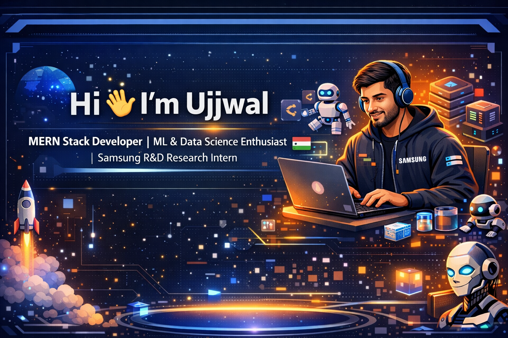

<!-- ===================================================== -->
<!--                🔥 UJJWAL PREMIUM README              -->
<!-- ===================================================== -->

<p align="center">
  
</p>

<h1 align="center">
  
</h1>

<p align="center">
  
</p>

---

# 🚀 About Me

```diff
+ MERN Stack Developer
+ Machine Learning & Data Science Enthusiast
+ Samsung R&D Research Intern (PRISM Program)
+ 3rd Year Computer Science Student
+ Passionate about AI, Research & Scalable Backend Systems
+ Preparing for Top Product-Based Companies
```

📧 Email: ujjwal2282@gmail.com  
🔗 LinkedIn: https://www.linkedin.com/in/ujjwal2282/  
💻 GitHub: https://github.com/UJJWAL2282  

---

# 🧠 Tech Stack

## 🌐 MERN Stack
<p align="center">
  
</p>

## 🤖 Machine Learning & Data Science
<p align="center">
  
</p>

## ⚙️ Tools & Platforms
<p align="center">
  
</p>

---

# 📊 GitHub Stats

<p align="center">
  
  
</p>

<p align="center">
  
</p>

---

# 📈 Contribution Activity

<p align="center">
  
</p>

---

# 🎯 Current Focus

- 🔥 Building scalable MERN applications  
- 🤖 Developing real-time ML systems  
- 📊 Data-driven dashboards  
- 🧠 Strengthening DSA & System Design  
- 🔬 Research & innovation at Samsung R&D  

---

# 🌟 Featured Projects

### 🏥 AI Health Monitoring Dashboard
Real-time anomaly detection with ML integration and interactive visualization.

### 🛒 MERN E-Commerce Platform
Authentication, REST APIs, payment integration, optimized backend.

### 📡 Network Traffic Analyzer
Machine Learning-based predictive monitoring & alert system.

### 🎓 Smart Placement Portal
Automated student-job matching platform using ranking algorithms.

---

# 🏆 Achievements

<p align="center">
  
</p>

---

# 🤝 Connect With Me

<p align="center">
  <a href="https://www.linkedin.com/in/ujjwal2282/">
    
  </a>
  <a href="mailto:ujjwal2282@gmail.com">
    
  </a>
  <a href="https://github.com/UJJWAL2282">
    
  </a>
</p>

---

<p align="center">
  
</p>

---

<h3 align="center">
✨ Code • Build • Research • Innovate ✨
</h3>
